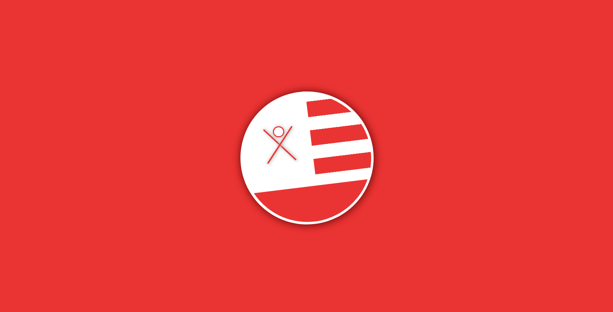

## Clube Náutico Capibaribe Logo

## Sobre o projeto/ About the project

🟩 Projeto realizado para estudo

🟨 Proyecto realizado para estudio

🟥 Project carried out to study

## Feito usando/ Builded using

•	📄 HTML

•	🎨 CSS

•	🧶 Git & Git Hub

## Ícones/ Icons

•	📦 Nova funcionalidade/ New functionality

•	🆙 Atualização / Update

•	⚠️ Correção de bug/ Bug correction

•	🏁 Release
